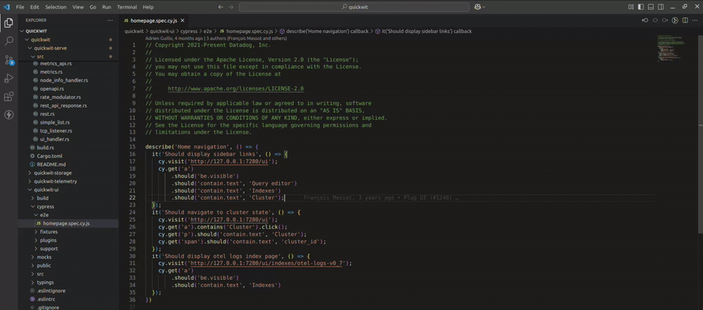

# Function Name Search - VSCode Extension

## Overview
The **Function Name Search** extension for VSCode allows users to quickly search for function names across a repository. Similar to the "Go to File" feature, this extension provides a searchable(supports subsequence search) list of function names, displaying the filename and line number, and enables quick navigation to the function.

## Preview


## Features
- Search function names across the repository.
- Subsequence search with smart re-ranking toward the current file type.
- Displays filename and line number for each match.
- Navigate to the function by selecting it from the list.
- Persistent on-disk cache (SQL.js) for instant startup; incremental background updates.
- Debounced file watching and worker-thread parsing for performance on large repos.
- Command to clear and rebuild the index.

## Architecture

The extension is organized with clear separation of concerns and a consistent messaging layer.

### Layers

- Commands: user-triggered entry points (`src/commands/*`).
- Services: feature orchestration (`src/services/indexer.js`, `src/services/watcher.js`, `src/services/quickpick.js`).
- Messaging (main thread): `src/services/messaging/bus.js` (message names in `src/config/constants.js`).
- Messaging (worker thread): `src/services/messaging/workerBus.js`.
- Transport: `src/services/workerManager.js` (owns the raw Node `Worker`).
- Workers: `src/services/workers/*` (CPU/file heavy logic).
- Config/Utils: `src/config/*`, `src/utils/*`.

### Message shape

All inter-thread messages use the same envelope:

```json
{ "type": "<MESSAGE_NAME>", "priority": "low|high", "payload": { /* data */ } }
```

Message names are exported from `src/config/constants.js`:

```js
// src/config/constants.js
const EXTRACT_FILE_NAMES = 'extractFileNames';
const EXTRACT_FUNCTION_NAMES = 'extractFunctionNames';
const FETCHED_FUNCTIONS = 'fetchedFunctions';
const WRITE_CACHE_TO_FILE = 'write-cache-to-file';
const INODE_MODIFIED_AT = 'inodemodifiedat';
```

### Flow (arrow diagram)

```
Commands
   | (VSCode command)
   v
Services (Indexer/Watcher/QuickPick)
   | (Bus API: extractFileNames / setInodeModifiedAt / writeCacheToFile)
   v
Messaging Bus (main thread)
   | (delegates send to Transport)
   v
Transport (WorkerManager)
   | (raw worker.postMessage / worker.on)
   v
Worker (extractFileNameWorker)
   | (child bus send)
   v
Worker (extractFunctionNameWorker)
   | (parent bus send)
   v
Transport (WorkerManager) -> Services (receive FETCHED_FUNCTIONS)
```

### Key responsibilities

- WorkerManager (transport):
  - Owns `Worker` lifecycle and provides a minimal `postMessage(message)` bridge.
  - Validates/filters messages (e.g., file extension guard) before forwarding.
  - Emits worker messages upstream; no feature logic here.

- Bus (main thread):
  - Simple API for services: `extractFileNames(payload, priority)`, `setInodeModifiedAt(map, priority)`, `writeCacheToFile(filePath, priority)`.
  - Ensures messages conform to the envelope and named constants.

- Worker Bus (worker thread):
  - Uniform `.send(type, payload, priority)` / `.on(type, handler)` for `parentPort` and nested child worker.

- Services (Indexer/Watcher):
  - Call Bus APIs only; never talk to `Worker` directly.
  - Maintain in-memory state (function index, caches) and react to `FETCHED_FUNCTIONS`.

### Commands and keybindings

- Search Function Name: command `extension.searchFunction`.
  - Default keybinding: `Ctrl+K` (alternative: `Ctrl+Shift+K`).
  - The extension detects Cursor vs VS Code and sets `functionSearch.isCursor` to adjust keybindings.
- Clear Function Index (Current Project): command `extension.clearFunctionIndex`.
  - Removes on-disk cache and in-memory index, then triggers a fresh reindex.

### Extending

- Add a new message name to `messages.js`.
- Use Bus `.send` from services; handle in workers; route back via Bus.
- Keep WorkerManager free of feature logic; it should remain a transport boundary.

## Installation
1. Open VSCode.
2. Go to **Extensions** (`Ctrl+Shift+X` or `Cmd+Shift+X` on macOS).
3. Search for `Function Name Search`.
4. Click **Install**.

## Usage
1. Open the command palette (`Ctrl+Shift+P` or `Cmd+Shift+P` on macOS).
2. Type `Search Function Name` and select the command or (`Ctrl+k` or `Cmd+k` on macOS)..
3. Start typing a function name to search.
4. Click on a result to navigate to the function.

### Indexing and cache

- On first activation, the extension loads any cached index from disk and triggers background indexing via workers.
- The index snapshots to disk periodically, keeping startup fast on subsequent sessions.
- File changes are debounced and re-parsed incrementally for responsive updates.

## Configuration
- **Language Support:** Java, Python, Go, JavaScript, TypeScript, Ruby, Kotlin, C, C++, C#, PHP, Rust, Swift.
- **Indexing:** Functions are indexed on first use and updated dynamically, with a persistent SQL.js-backed cache.

## Contributing
Contributions are welcome! To contribute:
1. Fork the repository.
2. Create a new branch.
3. Implement changes and commit.
4. Open a pull request.

## Support
For issues and feature requests, open a GitHub issue or contact us via email.

